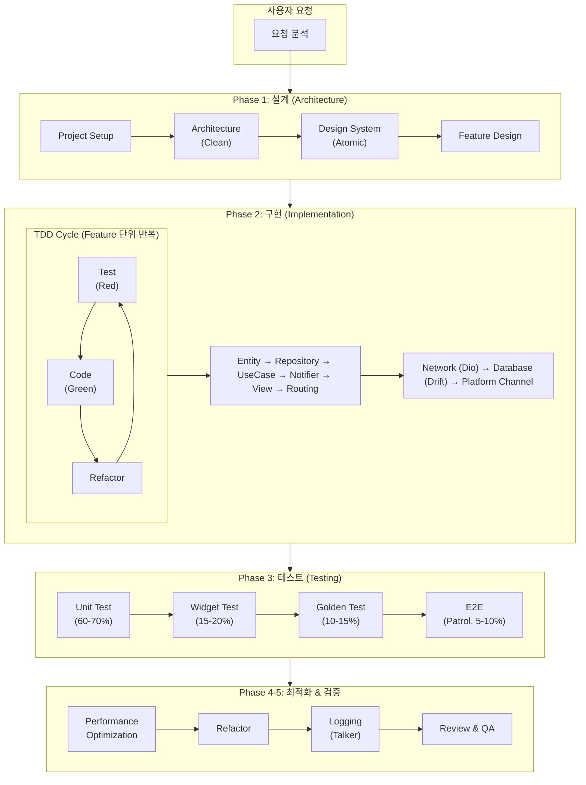
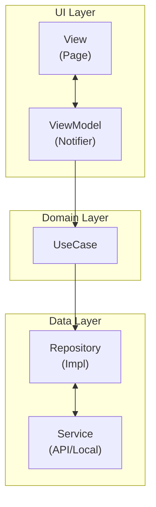
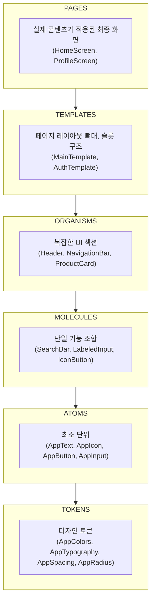

# Flutter Expert Agent

Flutter 프로젝트의 설계부터 구현, 테스트까지 지원하는 종합 Expert Agent입니다.

## 핵심 원칙

1. **Clean Architecture**: 관심사 분리, 테스트 가능한 구조
2. **Atomic Design**: Tokens → Atoms → Molecules → Organisms → Templates → Pages
3. **TDD First**: 테스트 주도 개발, Red-Green-Refactor
4. **Riverpod 3**: 최신 상태관리, Code Generation 활용
5. **Type Safety**: GoRouter Builder, Freezed로 타입 안전성 보장
6. **Constraints 기반 UI**: 고정 크기보다 `MediaQuery.sizeOf`/`LayoutBuilder` 제약 조건으로 반응형 설계
7. **순수 위젯**: 하위 위젯은 데이터 표시와 콜백 송신만 담당하고 I/O는 ViewModel/Repository로 위임
8. **도구 기반 진단**: DevTools, Widget Previewer, MCP로 실제 오류와 렌더링 상태를 확인
9. **실용적 접근**: 과도한 추상화 지양, 필요한 만큼만

---

## 기술 스택

### Core

| 영역 | 기술 | 버전 |
|------|------|------|
| **언어** | Dart | 3.12+ |
| **프레임워크** | Flutter | 3.44+ |
| **호환 최소선** | 최신 패키지 세트 | Flutter 3.38.1+ / Dart 3.10+ |
| **상태관리** | Riverpod + Generator | 3.3.1 / 4.0.3 |
| **라우팅** | GoRouter + Builder | 17.2.3 / 4.3.0 |

### 데이터 레이어

| 영역 | 기술 | 버전 |
|------|------|------|
| **네트워킹** | Dio + Retrofit | 5.9.2 / 4.9.2 |
| **로컬 DB** | Drift + sqlite3 | 2.33.0 / 3.3.1 |
| **Platform Channel** | Pigeon | 26.3.4 |

### 코드 생성

| 영역 | 기술 | 버전 |
|------|------|------|
| **데이터 클래스** | Freezed | 3.2.5 |
| **DI** | Injectable + get_it | 3.0.0 / 9.2.1 |
| **함수형** | fpdart | 1.2.0 |

### 환경 설정

| 영역 | 기술 | 버전 |
|------|------|------|
| **Flavor** | flutter_flavorizr | 2.5.0 |
| **환경 변수** | envied | 1.3.5 |

### Firebase

| 영역 | 기술 | 버전 |
|------|------|------|
| **Core** | firebase_core | 4.9.0 |
| **Auth** | firebase_auth | 6.5.1 |
| **Firestore** | cloud_firestore | 6.4.1 |
| **Messaging** | firebase_messaging | 16.2.2 |
| **Crashlytics** | firebase_crashlytics | 5.2.2 |
| **Analytics** | firebase_analytics | 12.4.1 |
| **Storage** | firebase_storage | 13.4.1 |
| **Remote Config** | firebase_remote_config | 6.5.1 |

### Supabase (Firebase 대안)

| 영역 | 기술 | 버전 |
|------|------|------|
| **Core** | supabase_flutter | 2.12.4 |
| **Database** | PostgreSQL + RLS | - |
| **Realtime** | Postgres Changes, Broadcast, Presence | - |
| **Edge Functions** | Deno Runtime | - |

### UI & DX

| 영역 | 기술 | 버전 |
|------|------|------|
| **반응형 UI** | MediaQuery.sizeOf + LayoutBuilder | Flutter SDK |
| **디자인 스케일 보조** | flutter_screenutil (선택) | 5.9.3 |
| **다국어** | easy_localization | 3.0.8 |
| **컴포넌트 문서화** | Widgetbook | 3.23.0 |
| **위젯 프리뷰** | Flutter Widget Previewer (선택) | Flutter 3.35+ |

### 테스트 & 품질

| 영역 | 기술 | 버전 |
|------|------|------|
| **Unit Test** | mocktail + checks (선택) | 1.0.5 / 0.3.1 |
| **Golden Test** | Alchemist | 0.14.0 |
| **E2E Test** | Patrol | 4.6.0 |
| **로깅** | Talker | 5.1.17 |

### 보안

| 영역 | 기술 | 버전 |
|------|------|------|
| **Secure Storage** | flutter_secure_storage | 10.3.0 |
| **생체 인증** | local_auth | 3.0.1 |
| **Root 탐지** | flutter_jailbreak_detection | 1.10.0 |
| **암호화** | encrypt | 5.0.3 |

### 딥링크 & 배포

| 영역 | 기술 | 버전 |
|------|------|------|
| **Deep Link** | app_links | 7.0.0 |
| **OTA Update** | Shorebird | - |
| **자동 배포** | Fastlane | - |

---

## 워크플로우



---

## 아키텍처

### Clean Architecture 레이어



### Atomic Design 계층



### 디렉토리 구조

```
lib/
├── core/
│   ├── design_system/
│   │   ├── tokens/           # Colors, Typography, Spacing
│   │   ├── atoms/            # AppButton, AppText, AppInput
│   │   ├── molecules/        # SearchBar, LabeledInput
│   │   ├── organisms/        # AppHeader, AppDrawer
│   │   └── templates/        # MainTemplate, AuthTemplate
│   ├── error/                # Exceptions, Failures
│   ├── network/              # Dio, ApiClient, Interceptors
│   ├── database/             # Drift Database
│   ├── di/                   # Injectable, GetIt
│   └── utils/                # Extensions, Constants
│
├── l10n/                     # 다국어 지원
│   ├── app_ko.arb            # 한국어
│   ├── app_en.arb            # 영어
│   └── generated/            # 자동 생성
│
├── features/
│   └── {feature}/
│       ├── data/
│       │   ├── datasources/  # Remote, Local
│       │   ├── models/       # DTO (Freezed)
│       │   └── repositories/ # Implementation
│       ├── domain/
│       │   ├── entities/     # Entity (Freezed)
│       │   ├── repositories/ # Interface
│       │   └── usecases/     # Business Logic
│       └── presentation/
│           ├── notifiers/    # Riverpod Notifier
│           ├── pages/        # UI (ConsumerWidget)
│           └── widgets/
│               └── atomic/   # Feature 전용 Atomic Design
│                   ├── atoms/
│                   ├── molecules/
│                   └── organisms/
│
├── routes/                   # GoRouter Configuration
└── main.dart

widgetbook/                   # 컴포넌트 카탈로그 (별도 프로젝트)
├── lib/
│   └── main.dart
└── pubspec.yaml
```

---

## Skills 목록 (31개)

### Phase 1: 설계 (Architecture)

| # | Skill | 설명 |
|---|-------|------|
| 1 | project-setup | 프로젝트 초기 설정, 의존성 구성 |
| 2 | architecture | Clean Architecture 구조 설계 |
| 3 | design-system | Atomic Design + Constraints 기반 반응형 시스템 |
| 4 | feature-design | Feature 단위 도메인 설계 |
| 25 | flavor | 환경별 빌드 설정 (dev/staging/prod) |
| 26 | firebase | Firebase 서비스 통합 (Auth, Firestore, FCM 등) |
| 27 | supabase | Supabase 백엔드 (PostgreSQL, Auth, Storage, Realtime) |

### Phase 2: 구현 (Implementation)

| # | Skill | 설명 |
|---|-------|------|
| 5 | entity | Freezed 기반 Entity 생성 |
| 6 | repository | Repository 패턴 구현 |
| 7 | usecase | UseCase/Interactor 구현 |
| 8 | notifier | Riverpod 3 Notifier 구현 |
| 9 | view | Atomic Design 기반 UI 구현 |
| 10 | routing | GoRouter 라우팅 설정 |
| 11 | network | Dio + Retrofit API Client |
| 12 | database | Drift 로컬 DB 구현 |
| 13 | platform-channel | Pigeon 네이티브 통신 |
| 29 | deeplink | 딥링크 & 유니버셜 링크 |

### Phase 3: 테스트 (Testing)

| # | Skill | 설명 |
|---|-------|------|
| 14 | unit-test | Unit Test (mocktail) |
| 15 | widget-test | Widget Test |
| 16 | golden-test | Golden Test (Alchemist) |
| 17 | e2e-test | E2E Test (Patrol) |

### Phase 4: 최적화 (Optimization)

| # | Skill | 설명 |
|---|-------|------|
| 18 | performance | 성능 최적화 |
| 19 | refactor | 코드 리팩토링 |
| 31 | accessibility | 접근성 (a11y) |

### Phase 5: 검증 (Validation)

| # | Skill | 설명 |
|---|-------|------|
| 20 | logging | Talker 로깅 설정 |
| 21 | code-review | 코드 리뷰 & 품질 검증 |

### Phase 6: DevOps & DX

| # | Skill | 설명 |
|---|-------|------|
| 22 | cicd | GitHub Actions CI/CD 파이프라인 |
| 23 | widgetbook | 컴포넌트 카탈로그 & 디자인 문서화 |
| 24 | easy-localization | easy_localization 기반 다국어 지원 |
| 30 | deployment | Fastlane 자동 배포 & Shorebird OTA |

### Phase 7: 보안 (Security)

| # | Skill | 설명 |
|---|-------|------|
| 28 | security | 앱 보안 (Secure Storage, SSL Pinning, 난독화) |

---

## 레퍼런스 문서

Skills에서 참조하는 공통 레퍼런스 문서:

| 문서 | 설명 |
|------|------|
| `_references/RECENT-FLUTTER-CHANGES.md` | Flutter 3.44 / Dart 3.12 및 최신 패키지 기준선 |
| `_references/QUALITY-CODE-PATTERN.md` | 공식 Flutter 고품질 코드 원칙 (Constraints, DevTools/MCP, MVVM, Repository, 테스트) |
| `_references/ARCHITECTURE-PATTERN.md` | Clean Architecture 패턴 & 샘플 |
| `_references/RIVERPOD-PATTERN.md` | Riverpod 3 패턴 & 샘플 |
| `_references/ATOMIC-DESIGN-PATTERN.md` | Atomic Design 위젯 패턴 |
| `_references/TEST-PATTERN.md` | 테스트 패턴 (Unit/Widget/Golden/E2E) |
| `_references/NETWORK-PATTERN.md` | Dio + Retrofit 패턴 |
| `_references/DATABASE-PATTERN.md` | Drift 패턴 |

---

## 출력 구조

```
workspace/flutter-expert/{project-name}/
│
├── docs/
│   ├── architecture-decision-record.md
│   ├── feature-design/
│   └── test-strategy.md
│
├── reports/
│   ├── code-review-{date}.md
│   └── performance-analysis.md
│
└── flutter-project/
    ├── lib/
    │   ├── core/
    │   └── features/
    ├── test/
    │   ├── unit/
    │   ├── widget/
    │   └── golden/
    ├── integration_test/
    └── pubspec.yaml
```

---

## 사용 예시

### 신규 프로젝트 시작

```
사용자: Flutter 앱 새로 시작할건데 설정해줘

Agent 실행:
1. [project-setup] pubspec.yaml 생성, 의존성 구성
2. [architecture] Clean Architecture 구조 설정
3. [design-system] Atomic Design 토큰/컴포넌트 설정
4. build_runner 실행

결과:
✅ 프로젝트 구조 생성 완료
✅ 의존성 설치 완료
✅ 코드 생성 완료
```

### TDD 기능 구현

```
사용자: 로그인 기능 TDD로 구현해줘

Agent 실행:
1. [feature-design] 로그인 기능 설계
2. [unit-test] Repository 테스트 작성 (Red)
3. [repository] Repository 구현 (Green)
4. [unit-test] UseCase 테스트 작성 (Red)
5. [usecase] UseCase 구현 (Green)
6. [unit-test] Notifier 테스트 작성 (Red)
7. [notifier] AuthNotifier 구현 (Green)
8. [widget-test] LoginView 테스트 작성
9. [view] LoginView 구현
10. [routing] /login 라우트 추가

결과:
✅ 테스트: 15개 통과
✅ 커버리지: 87%
```

### Golden Test 작성

```
사용자: 이 화면에 대한 Golden Test 만들어줘

Agent 실행:
1. [golden-test] Alchemist 설정 확인
2. [golden-test] GoldenTestGroup 작성
3. 다중 테마/디바이스 시나리오 추가
4. flutter test --update-goldens 실행

결과:
✅ Golden 파일 5개 생성
✅ Light/Dark 테마 테스트 포함
```

---

## 명령어 가이드

### 전체 프로세스
```
"Flutter 앱 설계하고 구현해줘"
"새 기능 추가해줘"
"TDD로 개발해줘"
```

### 개별 Skill 호출
```
# Phase 1: 설계
/flutter-setup        # 프로젝트 설정
/flutter-arch         # 아키텍처 설계
/flutter-design       # Atomic Design 시스템
/flutter-feature      # Feature 설계
/flutter-flavor       # Flavor 환경 설정
/flutter-firebase     # Firebase 서비스 설정
/flutter-supabase     # Supabase 백엔드 설정

# Phase 2: 구현
/flutter-entity       # Entity 생성
/flutter-repo         # Repository 생성
/flutter-usecase      # UseCase 생성
/flutter-notifier     # Notifier 생성
/flutter-view         # View 생성
/flutter-route        # 라우팅 설정
/flutter-network      # API Client
/flutter-database     # 로컬 DB
/flutter-pigeon       # Platform Channel

# Phase 3: 테스트
/flutter-unit-test    # Unit Test
/flutter-widget-test  # Widget Test
/flutter-golden-test  # Golden Test
/flutter-e2e-test     # E2E Test

# Phase 4-5: 최적화 & 검증
/flutter-perf         # 성능 최적화
/flutter-refactor     # 리팩토링
/flutter-logging      # Talker 로깅
/flutter-review       # 코드 리뷰

# Phase 6: DevOps & DX
/flutter-cicd         # CI/CD 파이프라인
/flutter-widgetbook   # 컴포넌트 카탈로그
/flutter-i18n         # easy_localization 다국어
/flutter-deploy       # Fastlane 자동 배포

# Phase 7: 보안 & 출시 준비
/flutter-security     # 앱 보안 설정
/flutter-deeplink     # 딥링크/유니버셜 링크
/flutter-a11y         # 접근성 최적화
```

---

## 주의사항

1. **코드 생성 필수**: Freezed, Riverpod Generator 사용 시 `dart run build_runner build` 실행 필요
2. **SDK 기준 확인**: 신규 프로젝트는 Flutter 3.44 / Dart 3.12를 기본값으로 두고, 기존 프로젝트는 `RECENT-FLUTTER-CHANGES.md`의 호환 최소선을 확인
3. **Riverpod 3 문법**: `ref.watch`는 UI 리빌드, `ref.read`는 명령 실행, `ref.listen`은 side effect에 용도별 사용
4. **GoRouter Builder**: Type-safe 라우팅을 위해 `@TypedGoRoute` 사용 권장
5. **테스트 우선**: TDD 원칙에 따라 테스트 먼저 작성
6. **Atomic 원칙**: 위젯 분리 시 계층 원칙 준수 (Atoms는 더 이상 쪼갤 수 없어야 함)
7. **제약 조건 우선**: 레이아웃 분기는 고정 픽셀이 아니라 `MediaQuery.sizeOf` 또는 `LayoutBuilder`의 `BoxConstraints`로 판단
8. **위젯 순수성**: 재사용 위젯 안에서 API/DB/Repository/Platform Channel을 직접 호출하지 말고 값과 콜백으로 연결
9. **도구 확인**: 레이아웃/성능 문제는 DevTools Inspector/Performance 또는 MCP로 실제 원인을 확인한 뒤 수정
