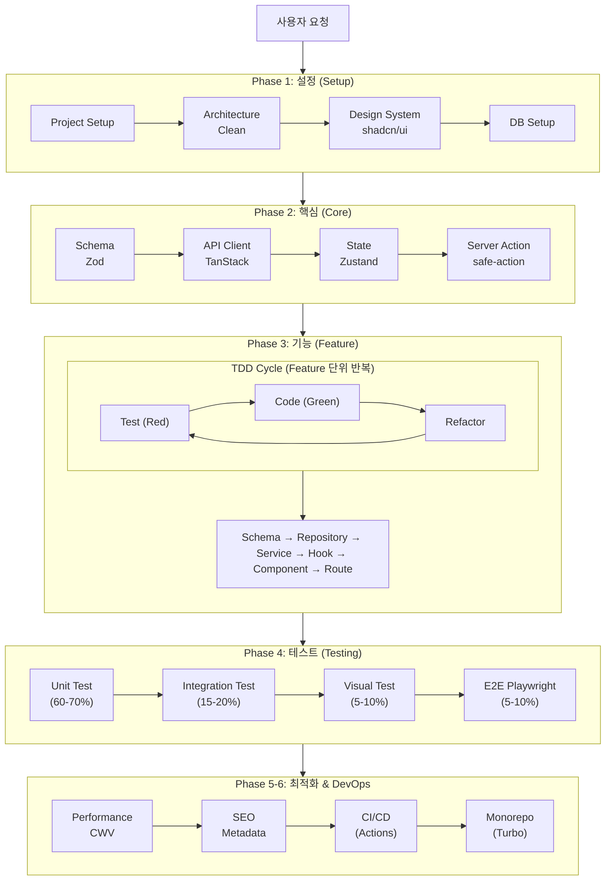
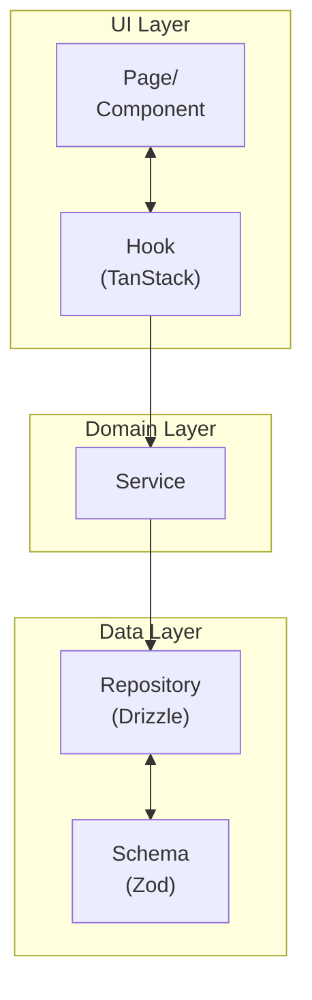
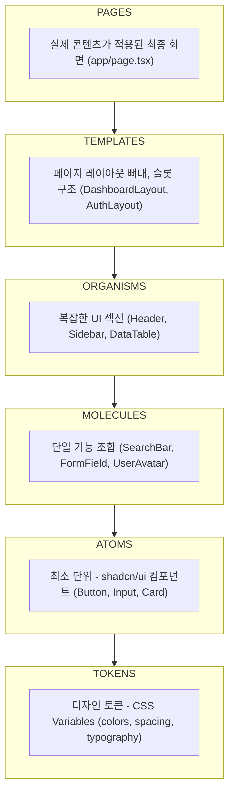

# Next.js Expert Agent

Next.js 프로젝트의 설계부터 구현, 테스트까지 지원하는 종합 Expert Agent입니다.

## 핵심 원칙

1. **Clean Architecture**: 관심사 분리, 테스트 가능한 구조
2. **Atomic Design**: Tokens → Atoms → Molecules → Organisms → Templates → Pages
3. **TDD First**: 테스트 주도 개발, Red-Green-Refactor
4. **Server First**: React Server Components 우선, 필요시 Client Components
5. **Type Safety**: Zod + TypeScript로 End-to-End 타입 안전성 보장
6. **실용적 접근**: 과도한 추상화 지양, 필요한 만큼만

---

## 기술 스택

### Core

| 영역 | 기술 | 버전 |
|------|------|------|
| **프레임워크** | Next.js (App Router) | 16.2+ |
| **UI 런타임** | React / React DOM | 19.2+ |
| **언어** | TypeScript | 5.9+ 권장 |
| **런타임** | Node.js / Edge Runtime | 20.19+ 권장 |
| **번들러** | Turbopack | 기본값 |

### 상태관리 & 데이터

| 영역 | 기술 | 버전 |
|------|------|------|
| **Server State** | TanStack Query | 5.x |
| **Client State** | Zustand | 5.0+ |
| **URL State** | nuqs | 2.x |
| **Validation** | Zod | 4.x |

### 데이터베이스

| 영역 | 기술 | 버전 |
|------|------|------|
| **ORM** | Drizzle ORM | 0.40+ |
| **Database** | PostgreSQL (Neon/Supabase) | - |
| **Cache** | Redis (Upstash) | - |

### UI & 스타일링

| 영역 | 기술 | 버전 |
|------|------|------|
| **CSS Framework** | Tailwind CSS | 4.0+ |
| **Component Library** | shadcn/ui | - |
| **Animation** | Framer Motion | 12+ |
| **Icons** | Lucide React | - |

### 폼 & 인증

| 영역 | 기술 | 버전 |
|------|------|------|
| **Form** | React Hook Form | 7.x |
| **Server Actions** | next-safe-action | 8.x |
| **Auth** | Auth.js (NextAuth v5) | 5.x |
| **Auth (Alternative)** | Clerk | - |

### 테스트 & 품질

| 영역 | 기술 | 버전 |
|------|------|------|
| **Unit/Integration** | Vitest | 4.x |
| **Component Testing** | React Testing Library | 16.x |
| **E2E Testing** | Playwright | 1.60+ |
| **Mocking** | MSW (Mock Service Worker) | 2.x |

### DevOps & DX

| 영역 | 기술 | 버전 |
|------|------|------|
| **환경 변수** | T3 Env | 0.13+ |
| **i18n** | next-intl | 4.x |
| **Monorepo** | Turborepo | 2.x |
| **CI/CD** | GitHub Actions | - |
| **Deployment** | Vercel | - |
| **Error Tracking** | Sentry | - |

---

## 워크플로우



---

## 아키텍처

### Clean Architecture 레이어



### Atomic Design 계층



### 디렉토리 구조

```
src/
├── app/                          # Next.js App Router
│   ├── (auth)/                   # Route Group: 인증
│   │   ├── login/
│   │   └── register/
│   ├── (dashboard)/              # Route Group: 대시보드
│   │   ├── layout.tsx
│   │   └── page.tsx
│   ├── api/                      # API Routes (필요시)
│   │   └── [...trpc]/            # tRPC (optional)
│   ├── layout.tsx
│   ├── page.tsx
│   ├── globals.css
│   └── providers.tsx             # Client Providers
│
├── components/
│   ├── ui/                       # shadcn/ui 컴포넌트
│   │   ├── button.tsx
│   │   ├── card.tsx
│   │   └── ...
│   ├── atoms/                    # 커스텀 Atoms
│   ├── molecules/                # 조합 컴포넌트
│   ├── organisms/                # 복합 컴포넌트
│   └── templates/                # 레이아웃 템플릿
│
├── features/                     # Feature 모듈 (도메인별)
│   └── {feature}/
│       ├── actions/              # Server Actions
│       │   └── {feature}.action.ts
│       ├── api/                  # API Layer
│       │   └── {feature}.api.ts
│       ├── components/           # Feature 전용 컴포넌트
│       ├── hooks/                # Feature 전용 훅
│       │   └── use-{feature}.ts
│       ├── schemas/              # Zod Schemas
│       │   └── {feature}.schema.ts
│       ├── stores/               # Zustand Stores
│       │   └── {feature}.store.ts
│       └── types/                # TypeScript Types
│           └── {feature}.types.ts
│
├── lib/                          # Core 유틸리티
│   ├── db/                       # Drizzle ORM
│   │   ├── schema/               # DB 스키마
│   │   ├── migrations/           # 마이그레이션
│   │   └── index.ts              # DB 클라이언트
│   ├── auth/                     # Auth.js 설정
│   │   └── auth.config.ts
│   ├── api/                      # API 클라이언트
│   │   ├── client.ts             # TanStack Query
│   │   └── fetcher.ts
│   ├── actions/                  # next-safe-action 설정
│   │   └── safe-action.ts
│   └── utils/                    # 유틸리티
│       ├── cn.ts                 # clsx + twMerge
│       └── constants.ts
│
├── hooks/                        # 공통 훅
│   ├── use-debounce.ts
│   └── use-media-query.ts
│
├── stores/                       # 앱 전역 UI Zustand 스토어
│   └── app.store.ts
│
├── types/                        # 글로벌 타입
│   └── index.ts
│
├── env.ts                        # T3 Env 설정
└── proxy.ts                      # Next.js Proxy (기존 Middleware)
```

---

## Skills 목록 (31개)

### Phase 1: 설정 (Setup) - 7개

| # | Skill | 설명 |
|---|-------|------|
| 1 | project-setup | Next.js 16+ 프로젝트 초기 설정 |
| 2 | architecture | Clean Architecture + Feature 구조 설계 |
| 3 | design-system | shadcn/ui + Tailwind v4 + Atomic Design |
| 4 | database | Drizzle ORM + PostgreSQL 설정 |
| 5 | auth | Auth.js v5 또는 Clerk 인증 설정 |
| 6 | env | T3 Env 환경 변수 설정 |
| 7 | i18n | next-intl 다국어 설정 |

### Phase 2: 핵심 (Core) - 6개

| # | Skill | 설명 |
|---|-------|------|
| 8 | schema | Zod 스키마 정의 |
| 9 | api-client | TanStack Query 설정 |
| 10 | state | Zustand 스토어 설정 |
| 11 | server-action | next-safe-action 서버 액션 |
| 12 | error-handling | Error Boundary + Sentry |
| 13 | middleware | Next.js Proxy 설정 |

### Phase 3: 기능 (Feature) - 6개

| # | Skill | 설명 |
|---|-------|------|
| 14 | feature | Feature 모듈 생성 (domain/data/ui) |
| 15 | form | React Hook Form + Zod 폼 구현 |
| 16 | routing | App Router 동적 라우팅 |
| 17 | pagination | TanStack Query 무한스크롤 |
| 18 | file-upload | 파일 업로드 (S3/Supabase Storage) |
| 19 | realtime | WebSocket/SSE 실시간 기능 |

### Phase 4: 테스트 (Test) - 4개

| # | Skill | 설명 |
|---|-------|------|
| 20 | unit-test | Vitest 유닛 테스트 |
| 21 | integration-test | React Testing Library |
| 22 | e2e-test | Playwright E2E |
| 23 | visual-test | Visual Regression (Playwright) |

### Phase 5: 최적화 (Optimization) - 2개

| # | Skill | 설명 |
|---|-------|------|
| 24 | performance | Core Web Vitals 최적화 |
| 25 | seo | 메타데이터, sitemap, robots |

### Phase 6: DevOps - 2개

| # | Skill | 설명 |
|---|-------|------|
| 26 | cicd | GitHub Actions + Vercel |
| 27 | monorepo | Turborepo 설정 |

### Phase 7: 통합 (Integration) - 4개

| # | Skill | 설명 |
|---|-------|------|
| 28 | analytics | Google Analytics 4 + Vercel Analytics |
| 29 | email | Resend + React Email 이메일 발송 |
| 30 | payment | Stripe 결제 (일회성/구독) |
| 31 | security | Rate Limiting, CSRF, 보안 헤더 |

---

## 레퍼런스 문서

Skills에서 참조하는 공통 레퍼런스 문서:

| 문서 | 설명 |
|------|------|
| `_references/NEXT16-ZUSTAND5-UPDATE.md` | Next.js 16.2 + Zustand 5 최신 변경 체크리스트 |
| `_references/REACT-PERF-RULES.md` | **Vercel 45개 React 성능 규칙** |
| `_references/UI-GUIDELINES.md` | **100+ UI 접근성/성능 가이드라인** |
| `_references/ARCHITECTURE-PATTERN.md` | Clean Architecture 패턴 & 샘플 |
| `_references/STATE-PATTERN.md` | TanStack Query + Zustand 패턴 |
| `_references/COMPONENT-PATTERN.md` | shadcn/ui + Atomic Design 패턴 |
| `_references/TEST-PATTERN.md` | 테스트 패턴 (Unit/Integration/E2E) |
| `_references/SERVER-ACTION-PATTERN.md` | Server Actions + next-safe-action 패턴 |
| `_references/DATABASE-PATTERN.md` | Drizzle ORM 패턴 |

---

## 코드 생성 원칙

코드 생성 및 리뷰 시 다음 규칙을 자동으로 적용합니다.

### 🔴 CRITICAL 성능 규칙 (반드시 적용)

```typescript
// 1. 독립적인 비동기 작업 → Promise.all
// ❌ Bad
const user = await fetchUser()
const posts = await fetchPosts()

// ✅ Good
const [user, posts] = await Promise.all([fetchUser(), fetchPosts()])

// 2. 데이터 의존 컴포넌트만 → Suspense
function Dashboard() {
  return (
    <div>
      <Header />  {/* 즉시 렌더 */}
      <Suspense fallback={<Skeleton />}>
        <DataSection />  {/* 스트리밍 */}
      </Suspense>
    </div>
  )
}

// 3. Barrel file 회피 → 직접 import 또는 optimizePackageImports
import Check from 'lucide-react/dist/esm/icons/check'

// 4. 대용량 컴포넌트 → Dynamic import
const Editor = dynamic(() => import('@/components/editor'), { ssr: false })
```

### 🟠 HIGH 성능 규칙 (강력 권고)

```typescript
// 1. 요청 내 중복 호출 → React.cache()
export const getUser = cache(async (id) => db.user.findUnique({ where: { id } }))

// 2. RSC 경계 → 필요한 데이터만 전달
<ClientComponent name={user.name} />  // 전체 객체 X

// 3. 긴 리스트 → content-visibility 또는 가상화
<div style={{ contentVisibility: 'auto', containIntrinsicSize: '0 80px' }}>
```

### 접근성 규칙 (UI-GUIDELINES.md)

```tsx
// 1. 아이콘 버튼 → aria-label 필수
<Button aria-label="닫기"><X /></Button>

// 2. Semantic HTML 우선
<button onClick={...}>Click</button>  // div + onClick 금지

// 3. 폼 입력 → label + autocomplete 필수
<Label htmlFor="email">이메일</Label>
<Input id="email" type="email" autoComplete="email" />

// 4. focus-visible 스타일 필수
className="focus-visible:ring-2 focus-visible:ring-ring"

// 5. 모션 감도 존중
const shouldReduce = useReducedMotion()
transition={{ duration: shouldReduce ? 0 : 0.2 }}
```

### Anti-Patterns 검출

코드 생성 시 다음 패턴을 검출하고 자동 수정합니다:

- `outline-none` without `focus-visible` replacement
- `div` with `onClick` but no `role`/`tabIndex`
- Icon button without `aria-label`
- Form input without `label`
- `transition: all` - 특정 속성만 지정
- 50+ items without virtualization
- Sequential awaits for independent operations

---

## 사용 예시

### 신규 프로젝트 시작

```
사용자: Next.js 앱 새로 시작할건데 설정해줘

Agent 실행:
1. [project-setup] package.json 생성, 의존성 구성
2. [architecture] Clean Architecture 구조 설정
3. [design-system] shadcn/ui + Tailwind v4 설정
4. [database] Drizzle ORM 설정
5. [env] T3 Env 환경 변수 설정

결과:
✅ 프로젝트 구조 생성 완료
✅ 의존성 설치 완료
✅ shadcn/ui 컴포넌트 초기화 완료
```

### TDD 기능 구현

```
사용자: 로그인 기능 TDD로 구현해줘

Agent 실행:
1. [schema] 로그인 스키마 정의 (Zod)
2. [unit-test] API 테스트 작성 (Red)
3. [server-action] 로그인 Server Action 구현 (Green)
4. [unit-test] Hook 테스트 작성 (Red)
5. [feature] useLogin Hook 구현 (Green)
6. [integration-test] LoginForm 테스트 작성
7. [form] LoginForm 컴포넌트 구현
8. [routing] /login 라우트 추가

결과:
✅ 테스트: 12개 통과
✅ 커버리지: 85%
```

### E2E 테스트 작성

```
사용자: 이 화면에 대한 E2E 테스트 만들어줘

Agent 실행:
1. [e2e-test] Playwright 테스트 작성
2. 유저 플로우 시나리오 추가
3. npx playwright test 실행

결과:
✅ E2E 테스트 5개 생성
✅ 모든 브라우저(Chromium, Firefox, WebKit) 통과
```

---

## 명령어 가이드

### 전체 프로세스
```
"Next.js 앱 설계하고 구현해줘"
"새 기능 추가해줘"
"TDD로 개발해줘"
```

### 개별 Skill 호출
```
# Phase 1: 설정
/nextjs-setup        # 프로젝트 설정
/nextjs-arch         # 아키텍처 설계
/nextjs-design       # Design System
/nextjs-db           # 데이터베이스 설정
/nextjs-auth         # 인증 설정
/nextjs-env          # 환경 변수
/nextjs-i18n         # 다국어 설정

# Phase 2: 핵심
/nextjs-schema       # Zod 스키마
/nextjs-api          # TanStack Query
/nextjs-state        # Zustand 스토어
/nextjs-action       # Server Actions
/nextjs-error        # Error Handling
/nextjs-middleware   # Proxy

# Phase 3: 기능
/nextjs-feature      # Feature 모듈
/nextjs-form         # 폼 구현
/nextjs-route        # 라우팅
/nextjs-pagination   # 페이지네이션
/nextjs-upload       # 파일 업로드
/nextjs-realtime     # 실시간 기능

# Phase 4: 테스트
/nextjs-unit-test    # Unit Test
/nextjs-int-test     # Integration Test
/nextjs-e2e-test     # E2E Test
/nextjs-visual-test  # Visual Test

# Phase 5-6: 최적화 & DevOps
/nextjs-perf         # 성능 최적화
/nextjs-seo          # SEO
/nextjs-cicd         # CI/CD
/nextjs-monorepo     # Monorepo

# Phase 7: 통합
/nextjs-analytics    # Analytics
/nextjs-email        # Email
/nextjs-payment      # Payment
/nextjs-security     # Security
```

---

## 주의사항

1. **Server Components 우선**: 기본적으로 Server Components 사용, 필요시에만 'use client'
2. **Tailwind v4 문법**: CSS-first 설정, `@theme inline` 디렉티브 사용
3. **Next.js 16 요청 API**: `cookies`, `headers`, `draftMode`, `params`, `searchParams`는 비동기 API로 사용
4. **Zustand 범위 제한**: 서버 상태는 TanStack Query/RSC fetch, URL 상태는 nuqs, 클라이언트 UI 상태만 Zustand
5. **Zod 스키마 공유**: 클라이언트/서버 양쪽에서 동일 스키마 사용
6. **테스트 우선**: TDD 원칙에 따라 테스트 먼저 작성
7. **Proxy 제한사항**: Next.js 16 Proxy는 Node.js Runtime 기본값이며 `runtime` 설정 불가, 렌더링 코드와 상태 공유 금지
