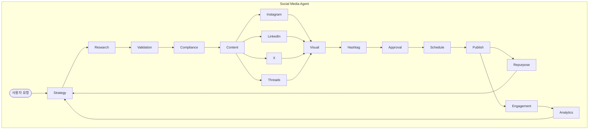
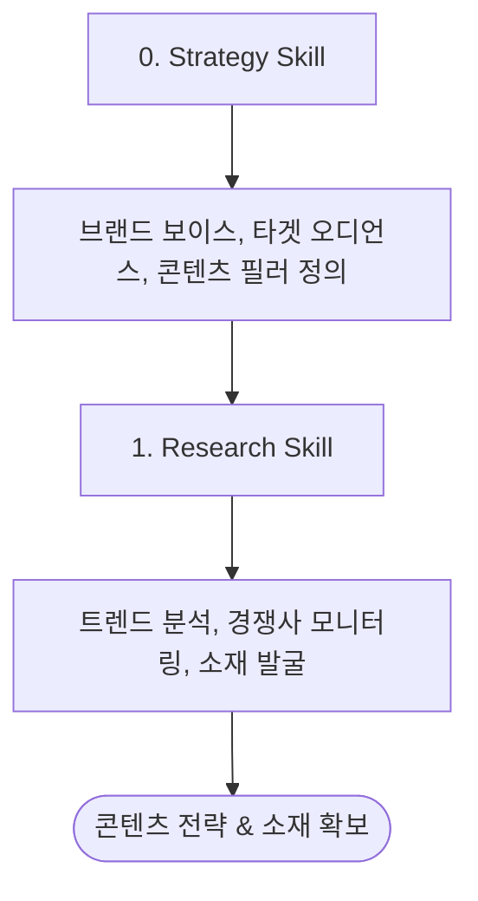
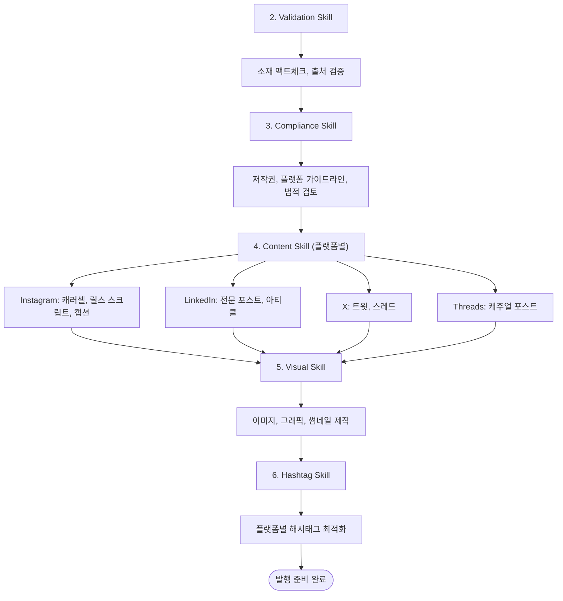
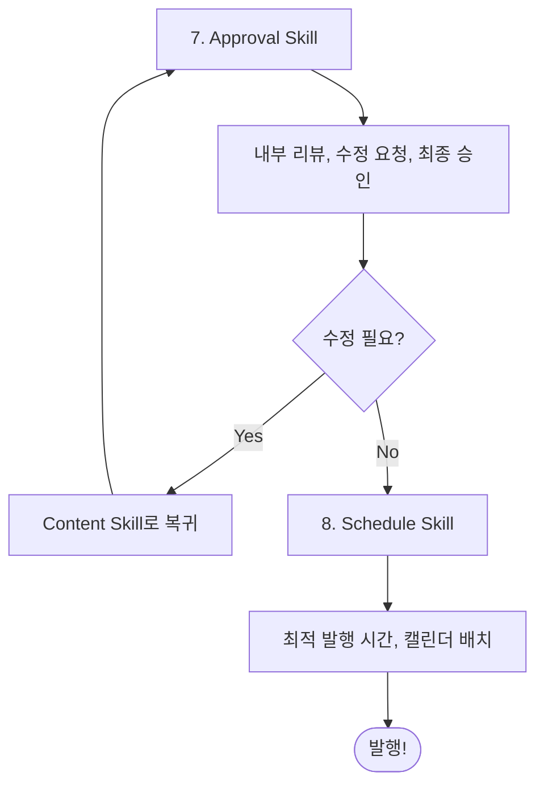
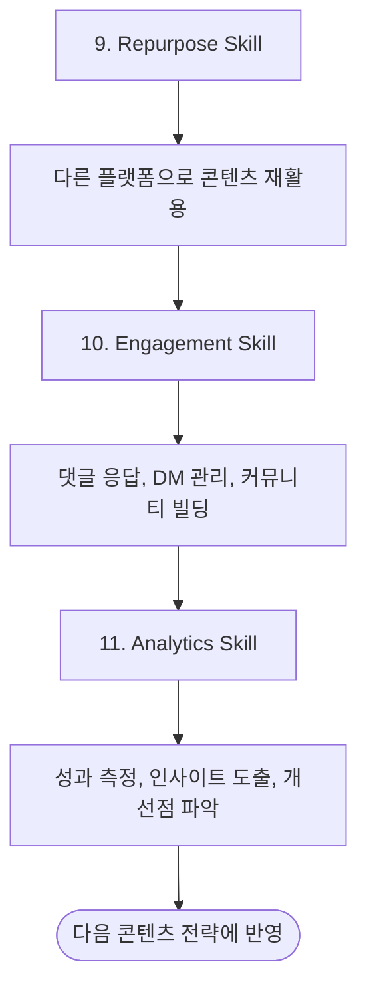

# Social Media Agent

멀티 플랫폼 소셜미디어 콘텐츠 제작을 위한 종합 Agent입니다.
전략 수립부터 발행, 성과 분석까지 소셜미디어 운영 전 과정을 체계적으로 관리합니다.

## 개요

Social Media Agent는 15개의 전문 Skills를 통합하여 4개 플랫폼에 최적화된 콘텐츠를 제작합니다.



## 지원 플랫폼

| 플랫폼 | 콘텐츠 유형 | 특성 |
|--------|-------------|------|
| **Instagram** | 피드, 릴스, 스토리, 캐러셀 | 비주얼 중심, 브랜드 인지도 |
| **LinkedIn** | 텍스트 포스트, 아티클, 캐러셀 | B2B, 전문성, 리드 생성 |
| **X (Twitter)** | 트윗, 스레드, 인용 | 실시간, 바이럴, 의견 공유 |
| **Threads** | 텍스트, 이미지 | 캐주얼, 커뮤니티, 대화 |

## 통합 Skills

| # | Skill | 역할 | 트리거 키워드 |
|---|-------|------|-------------|
| 0 | **social-strategy** | 브랜드 보이스, 타겟, 필러 정의 | "전략 세워줘", "브랜드 보이스" |
| 1 | **social-research** | 트렌드, 소재 리서치 | "트렌드 조사", "소재 찾아줘" |
| 2 | **social-validation** | 콘텐츠 팩트체크 | "팩트체크", "검증해줘" |
| 3 | **social-compliance** | 법적/가이드라인 검토 | "컴플라이언스", "규정 확인" |
| 4a | **social-content-instagram** | Instagram 콘텐츠 작성 | "인스타", "IG", "릴스" |
| 4b | **social-content-linkedin** | LinkedIn 콘텐츠 작성 | "링크드인", "LI" |
| 4c | **social-content-x** | X (Twitter) 콘텐츠 작성 | "트위터", "X", "스레드" |
| 4d | **social-content-threads** | Threads 콘텐츠 작성 | "스레드", "threads" |
| 5 | **social-visual** | 비주얼 제작 | "이미지 만들어", "비주얼" |
| 6 | **social-hashtag** | 해시태그 최적화 | "해시태그", "태그 추천" |
| 7 | **social-approval** | 승인 프로세스 | "승인 요청", "리뷰해줘" |
| 8 | **social-schedule** | 발행 스케줄링 | "스케줄", "캘린더", "예약" |
| 9 | **social-repurpose** | 크로스플랫폼 재활용 | "리퍼포징", "다른 플랫폼으로" |
| 10 | **social-engagement** | 커뮤니티 관리 | "댓글 관리", "응답 작성" |
| 11 | **social-analytics** | 성과 분석 | "분석", "성과 리포트" |

## 전체 워크플로우

### Phase 1: Strategy & Research (전략 수립)



### Phase 2: Content Creation (콘텐츠 제작)



### Phase 3: Approval & Publishing (승인 및 발행)



### Phase 4: Post-Publish (발행 후 관리)



## 사용 시나리오

### 시나리오 1: 처음부터 콘텐츠 제작

```
사용자: "AI 트렌드에 대한 소셜 콘텐츠 만들어줘"

Agent 실행 흐름:
1. [Strategy] 브랜드 보이스 확인, 타겟 정의
2. [Research] AI 트렌드 리서치, 소재 발굴
3. [Validation] 팩트체크
4. [Compliance] 저작권/가이드라인 검토
5. [Content] 플랫폼별 콘텐츠 작성
   - Instagram 캐러셀 + 캡션
   - LinkedIn 포스트
   - X 스레드
   - Threads 포스트
6. [Visual] 비주얼 제작
7. [Hashtag] 해시태그 최적화
8. [Approval] 최종 승인
9. [Schedule] 발행 스케줄링
```

### 시나리오 2: 단일 플랫폼 콘텐츠

```
사용자: "LinkedIn용 포스트 써줘"

Agent 실행 흐름:
1. [Research] 주제 리서치
2. [Content-LinkedIn] LinkedIn 최적화 포스트 작성
3. [Hashtag] LinkedIn 해시태그
4. [Approval] 승인
5. [Schedule] 발행
```

### 시나리오 3: 콘텐츠 리퍼포징

```
사용자: "이 블로그 글을 소셜 콘텐츠로 바꿔줘"

Agent 실행 흐름:
1. [Research] 원본 콘텐츠 분석
2. [Repurpose] 플랫폼별 변환
   - 핵심 메시지 추출
   - 플랫폼별 포맷 변환
   - 톤앤매너 조정
3. [Visual] 비주얼 제작
4. [Schedule] 발행 스케줄링
```

### 시나리오 4: 주간 캘린더 수립

```
사용자: "다음 주 콘텐츠 캘린더 만들어줘"

Agent 실행 흐름:
1. [Strategy] 주간 테마 확인
2. [Research] 소재 리서치
3. [Schedule] 주간 캘린더 배치
   - 월: IG 캐러셀 (교육)
   - 화: LI 포스트 (인사이트)
   - 수: X 스레드 (팁)
   - 목: TH 포스트 (대화)
   - 금: IG 릴스 (비하인드)
4. 각 슬롯별 콘텐츠 제작
```

### 시나리오 5: 성과 분석

```
사용자: "이번 달 성과 분석해줘"

Agent 실행 흐름:
1. [Analytics] 플랫폼별 데이터 수집
   - 참여율, 도달률, 팔로워 변화
   - Top 퍼포밍 콘텐츠
   - 저성과 콘텐츠
2. 인사이트 도출
3. 개선 제안
4. [Strategy] 다음 달 전략 조정
```

## 명령어 가이드

### 전체 프로세스 실행
```
"[주제]에 대한 소셜 콘텐츠 만들어줘"
"[플랫폼]용 콘텐츠 제작해줘"
"이번 주 소셜 캘린더 만들어줘"
```

### 특정 Skill 호출
```
/social-strategy            # 전략 수립
/social-research            # 리서치
/social-content-instagram   # Instagram 콘텐츠
/social-content-linkedin    # LinkedIn 콘텐츠
/social-content-x           # X 콘텐츠
/social-content-threads     # Threads 콘텐츠
/social-visual              # 비주얼 제작
/social-schedule            # 스케줄링
/social-analytics           # 분석
```

### 플랫폼 지정
```
"인스타그램 캐러셀 만들어줘"
"LinkedIn 포스트 써줘"
"X 스레드 작성해줘"
"Threads 포스트 만들어줘"
```

## 설정 옵션

### 브랜드 프로필 프리셋

```yaml
presets:
  startup_tech:
    voice: "친근하면서 전문적"
    platforms: ["linkedin", "x"]
    content_ratio:
      education: 40%
      brand: 30%
      community: 20%
      promo: 10%

  personal_brand:
    voice: "개인적, 진정성"
    platforms: ["instagram", "threads", "x"]
    content_ratio:
      insight: 35%
      story: 35%
      community: 20%
      promo: 10%

  b2b_enterprise:
    voice: "전문적, 권위"
    platforms: ["linkedin"]
    content_ratio:
      thought_leadership: 50%
      case_study: 30%
      company_news: 20%
```

### 발행 빈도 설정

```yaml
posting_frequency:
  aggressive:
    instagram: "1회/일"
    linkedin: "1회/일"
    x: "3-5회/일"
    threads: "2회/일"

  moderate:  # 권장
    instagram: "4회/주"
    linkedin: "3회/주"
    x: "1-2회/일"
    threads: "1회/일"

  minimal:
    instagram: "2회/주"
    linkedin: "2회/주"
    x: "3회/주"
    threads: "3회/주"
```

## 출력물

### 기본 산출물

```
work-social/
├── strategy/
│   └── brand-voice.md          # 브랜드 전략 문서
├── research/
│   └── {topic}-research.md     # 리서치 노트
├── drafts/
│   ├── instagram/
│   │   └── {date}-{title}.md   # IG 드래프트
│   ├── linkedin/
│   │   └── {date}-{title}.md   # LI 드래프트
│   ├── x/
│   │   └── {date}-{title}.md   # X 드래프트
│   └── threads/
│       └── {date}-{title}.md   # TH 드래프트
├── visuals/
│   └── {post-id}/              # 비주얼 에셋
├── calendar/
│   └── {month}-calendar.md     # 월간 캘린더
└── analytics/
    └── {month}-report.md       # 월간 리포트
```

### 콘텐츠 출력 형식

```yaml
content_output:
  post_id: "IG-2025-0107-001"
  platform: "instagram"
  type: "carousel"

  content:
    caption: "[캡션 텍스트]"
    slides:
      - "[슬라이드 1 내용]"
      - "[슬라이드 2 내용]"
    hashtags: ["#해시태그1", "#해시태그2"]
    cta: "[CTA 문구]"

  visual:
    format: "1080x1350"
    slides_count: 5

  schedule:
    publish_time: "2025-01-07 19:00 KST"
    status: "scheduled"
```

## 품질 체크리스트

### 콘텐츠 품질

```
□ 브랜드 보이스 일관성
□ 플랫폼 최적화 (글자수, 포맷)
□ 팩트체크 완료
□ 저작권/컴플라이언스 확인
□ CTA 명확성
□ 해시태그 적절성
```

### 비주얼 품질

```
□ 브랜드 가이드라인 준수
□ 플랫폼별 사이즈 최적화
□ 텍스트 가독성
□ 접근성 (alt text)
```

### 발행 전 확인

```
□ 오타/문법 체크
□ 링크 작동 확인
□ 멘션/태그 확인
□ 발행 시간 최적화
□ 민감한 이슈 체크
```

## 플랫폼별 최적화 가이드

### Instagram

```yaml
instagram:
  feed:
    ratio: "1:1 (1080x1080) 또는 4:5 (1080x1350)"
    caption_limit: 2200자
    hashtags: "5-15개 (첫 댓글 권장)"
  carousel:
    slides: "2-10장"
    best: "5-7장"
  reels:
    duration: "15-90초"
    ratio: "9:16"
  story:
    duration: "15초 이하"
    ratio: "9:16"
```

### LinkedIn

```yaml
linkedin:
  post:
    optimal_length: "1300자 내외"
    hooks: "첫 2줄이 핵심"
    hashtags: "3-5개"
  article:
    length: "1500-2000 단어"
  carousel:
    slides: "8-12장"
    format: "PDF 권장"
```

### X (Twitter)

```yaml
x:
  tweet:
    limit: "25,000자 (X Premium)"
    optimal: "300-800자 (읽기 편한 분량)"
    hashtags: "2-4개"
  thread:
    optimal: "5-15 트윗"
    numbering: "1/, 2/ 형식"
```

### Threads

```yaml
threads:
  post:
    limit: 500자
    style: "캐주얼, 대화체"
    hashtags: "선택적"
  best_practice:
    - "진정성 있는 대화"
    - "커뮤니티 참여"
```

## 문제 해결

| 문제 | 원인 | 해결 방법 |
|-----|------|----------|
| 참여율 저조 | 잘못된 발행 시간 | Schedule Skill로 최적 시간 분석 |
| 톤 불일치 | 브랜드 가이드 미적용 | Strategy Skill로 보이스 재정의 |
| 저작권 이슈 | 컴플라이언스 누락 | Compliance Skill 필수 실행 |
| 낮은 도달률 | 해시태그 최적화 부족 | Hashtag Skill로 재최적화 |
| 팔로워 이탈 | 과도한 프로모션 | 콘텐츠 필러 비율 조정 |

## 확장 가능성

### 추가 예정 기능

- [ ] 자동 발행 연동 (Buffer, Hootsuite API)
- [x] 생성형 이미지 단일 경로 (`image-prompt` → Codex `gpt-image-2`)
- [ ] 실시간 트렌드 알림
- [ ] A/B 테스트 자동화
- [ ] 경쟁사 모니터링 자동화
- [ ] DM 자동 응답 템플릿
- [ ] 인플루언서 협업 관리
- [ ] 다국어 콘텐츠 번역

---

*Social Media Agent는 멀티 플랫폼 소셜미디어 운영의 효율성과 일관성을 극대화하기 위해 설계되었습니다.*
