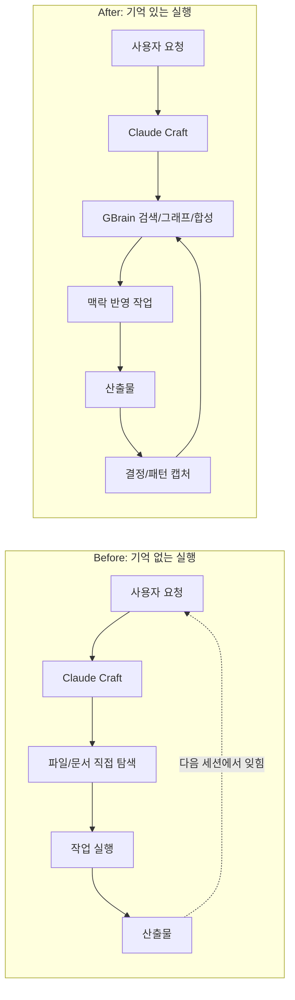
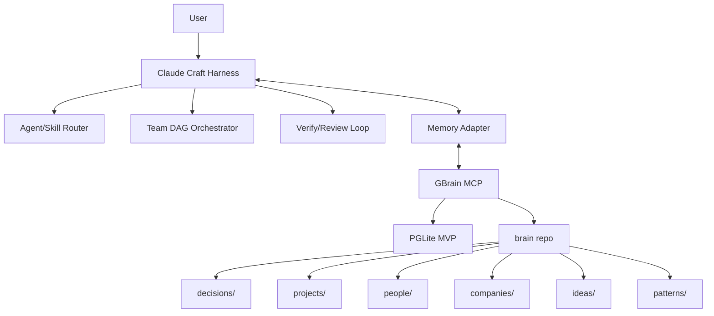
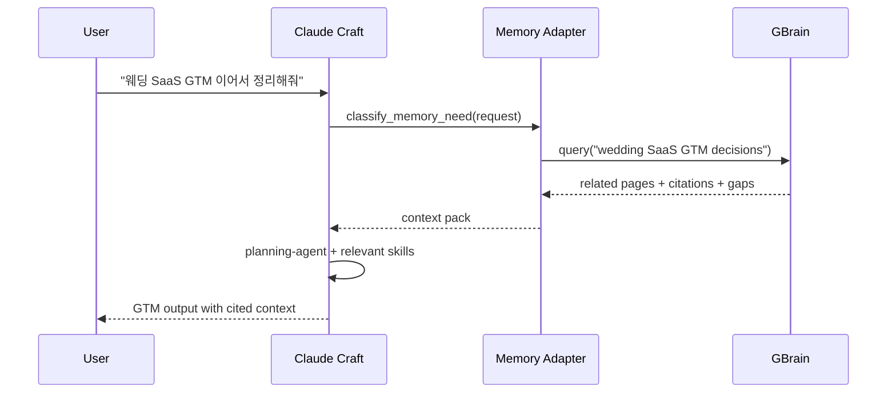
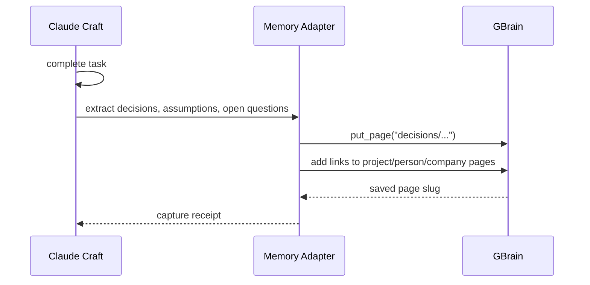
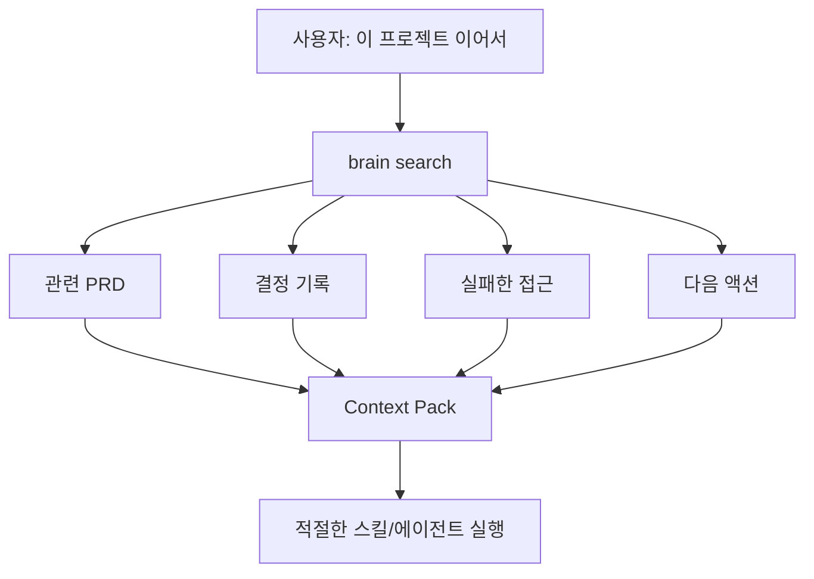
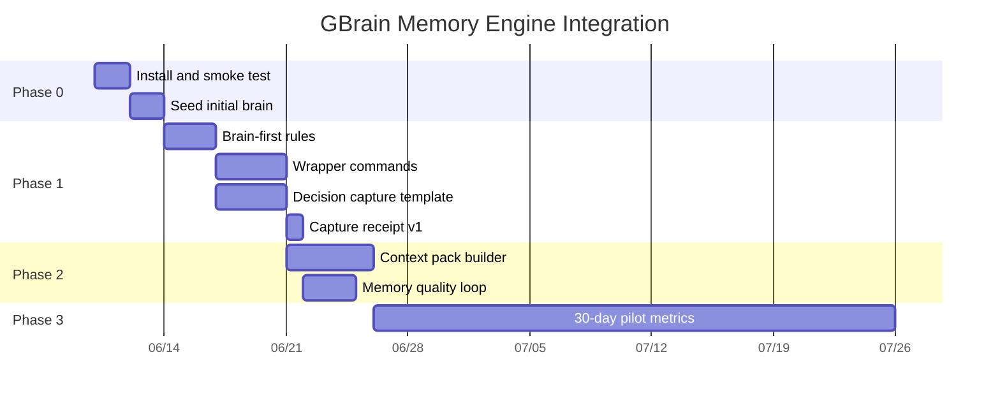

# GBrain Memory Engine Integration PRD

Date: 2026-06-10
Status: Phase 3 Pilot Started
Owner: Woogi
Product Area: Claude Craft Harness

## 1. Summary

Claude Craft에 GBrain을 하부 기억 엔진으로 흡수한다. 목적은 Claude Craft의 에이전트, 스킬, DAG 오케스트레이션은 유지하면서, 프로젝트 결정, 사람/회사/아이디어, 과거 산출물, 반복 패턴을 검색 가능한 장기 기억으로 연결하는 것이다.

MVP는 로컬 우선이다. GBrain PGLite + MCP + 별도 brain repo를 붙이고, Claude Craft는 작업 전 기억 검색과 작업 후 결정 캡처를 수행한다. 회사 브레인, 권한 스코프, 스킬 자동 최적화는 MVP 이후로 둔다.

Implementation snapshot as of 2026-06-10:

- GBrain `0.42.38.0` installed at `/Users/woogi/.bun/bin/gbrain`.
- Local brain source `brain-craft` registered against `/Users/woogi/brain-craft`.
- 31 seed pages and 355 chunks imported without embeddings.
- Codex MCP and Claude Code MCP both registered as `gbrain`.
- Claude Craft wrapper added at `scripts/brain-memory.sh`.
- Phase 1 QA wrapper added at `scripts/brain-memory-qa.sh`.
- Slash command docs added for `/brain-search`, `/brain-context`, `/brain-capture`, `/brain-sync`, `/brain-status`, and `/brain-quality`.
- Capture receipts are emitted for memory writes.
- Context packs are generated by `scripts/brain-memory.sh context`.
- Monthly quality review checklist is generated by `scripts/brain-memory.sh quality-report`.
- Phase 3 pilot metrics are logged by `scripts/brain-pilot.sh`.
- Phase 0 keeps embedding and dream/autopilot disabled until API/cost policy is explicit.

## 2. Contacts

| Name | Role | Comment |
| --- | --- | --- |
| Woogi | Owner / Primary User | 첫 사용자. 실제 Claude Craft 업무에서 기억 회수 효과를 검증한다. |
| Claude Craft | Core Harness | 에이전트, 스킬, 커맨드, DAG 실행의 단일 원천이다. |
| GBrain | Memory Engine | 검색, 합성, 지식 그래프, MCP 기억 계층을 제공한다. |
| Codex / Claude Code | Agent Clients | MCP를 통해 GBrain을 조회하고 Claude Craft 작업을 수행한다. |

## 3. Background

Claude Craft는 이미 실행 자산이 강하다.

- 25개 이상의 도메인 에이전트
- 374개 로컬 스킬
- `/team`, `/team-launch`, `/orchestrate` 기반 DAG 실행
- 디자인 하네스, 기획 스킬, 개발 스킬, 리뷰/검증 커맨드
- 세션 저장/복원, 스킬 학습, 프로젝트 동기화 스크립트

현재 병목은 "실행 능력"보다 "기억 회수"다.

- 사용자가 과거 결정과 문서 위치를 다시 설명한다.
- `/resume-session`은 세션 단위라 프로젝트 전체 맥락 회수에는 약하다.
- 스킬 실행 결과가 장기적으로 검색 가능한 지식 그래프로 축적되지 않는다.
- 프로젝트별 의사결정, 실패한 접근, 고객/회사/아이디어 맥락이 흩어진다.
- 새로운 에이전트 세션은 과거 맥락을 직접 찾아야 한다.

GBrain은 이 문제의 하부 레이어 후보로 적합하다. 공개 레포 기준 GBrain은 MCP 서버, PGLite/Postgres 엔진, hybrid search, 지식 그래프, schema pack, 회사 브레인 권한 모델, skillopt를 제공한다. 그러나 GBrain의 스킬/오케스트레이션은 Claude Craft의 핵심 자산을 대체하지 않는다.

따라서 도입 전략은 교체가 아니라 흡수다.

## 4. Objective

### Objective

Claude Craft가 작업 전 과거 맥락을 자동으로 찾고, 작업 후 중요한 결정과 패턴을 장기 기억에 저장하게 만든다.

### Why It Matters

Claude Craft는 이미 많은 작업을 수행할 수 있다. 하지만 매번 맥락을 다시 주입해야 하면 자동화 효율이 떨어진다. 기억 엔진을 붙이면 하네스가 "명령 실행 도구"에서 "일할수록 맥락이 쌓이는 AI 업무 OS"로 바뀐다.

### Key Results

| KR | Metric | Target |
| --- | --- | --- |
| KR1 | 과거 프로젝트 맥락 회수 시간 | 50% 이상 감소 |
| KR2 | brain-first 조회가 필요한 요청 중 실제 조회 비율 | 80% 이상 |
| KR3 | 완료 작업 중 결정/가정/패턴이 brain에 저장된 비율 | 60% 이상 |
| KR4 | 기억 검색 결과를 인용한 산출물 비율 | 50% 이상 |
| KR5 | 사용자가 같은 프로젝트 맥락을 반복 설명한 횟수 | 30일 내 30% 감소 |

### Success Criteria

MVP는 다음 조건을 만족하면 성공이다.

1. 로컬 GBrain이 설치되고 Codex/Claude Code에서 MCP로 조회된다.
2. Claude Craft 작업 요청 전 관련 brain 검색이 수행된다.
3. 작업 완료 후 결정, 가정, 실패한 접근, 다음 액션이 brain에 저장된다.
4. 저장된 내용이 다음 세션에서 검색되고 답변에 출처로 연결된다.
5. `.claude/` 운영 repo와 `brain/` 지식 repo의 경계가 지켜진다.

## 5. Market Segments

### Primary User

AI 에이전트를 업무 운영 체계로 쓰는 파워 유저다. 첫 사용자는 Woogi다.

이 사용자는 여러 프로젝트를 동시에 운영한다.

- SaaS 기획
- 개발 자동화
- 디자인 하네스 개선
- 콘텐츠/마케팅 전략
- 법무/재무 문서
- 한국생활 자동화 스킬

이 사용자에게 중요한 것은 "더 많은 프롬프트"가 아니라 "과거 맥락을 잊지 않는 실행 시스템"이다.

### Future Segment

MVP 검증 후에는 소규모 팀으로 확장한다.

- 2-10명 규모의 AI-native 팀
- 에이전트/스킬 자산을 함께 쓰는 창업팀
- 고객, 프로젝트, 회의, 결정 기록이 빠르게 쌓이는 조직

회사 브레인은 Postgres + OAuth scoped source가 필요하므로 MVP 이후로 둔다.

## 6. Value Propositions

### Core Value Proposition

"Claude Craft가 과거 결정을 기억하고, 현재 작업에 반영하고, 새 결정은 다시 기억한다."

### Before / After



### Value By Job

| Job | Pain Today | Value After Integration |
| --- | --- | --- |
| 프로젝트 재개 | 이전 문서와 결정을 다시 찾는다 | 관련 결정, PRD, 실패 접근을 먼저 회수한다 |
| 기획 | 과거 전략 문서가 분산된다 | 제품/시장/고객 맥락이 graph로 연결된다 |
| 개발 | 왜 이 구조를 택했는지 잊는다 | 기술 결정과 검증 결과가 검색된다 |
| 디자인 | 디자인 원칙이 세션마다 흔들린다 | 브랜드/디자인 결정이 재사용된다 |
| 스킬 개선 | 실패 패턴이 누적되지 않는다 | 반복 실패를 skill 개선 후보로 추출한다 |
| 팀 확장 | 사람마다 맥락이 다르다 | 향후 source scope로 지식 접근을 나눈다 |

## 7. Solution

### 7.1 Product Concept

GBrain은 Claude Craft 아래의 선택형 memory engine으로 동작한다.

Claude Craft는 계속해서 작업을 라우팅하고 실행한다. GBrain은 작업 전후의 기억을 담당한다.



### 7.2 Memory Boundaries

Claude Craft와 GBrain의 책임을 명확히 나눈다.

| Layer | Owns | Does Not Own |
| --- | --- | --- |
| Claude Craft | 에이전트, 스킬, 커맨드, 규칙, DAG, 검증 | 장기 world knowledge 저장 |
| GBrain | 프로젝트 지식, 결정, 사람/회사, 아이디어, 지식 그래프 | Claude Craft 스킬 라우팅의 최종 권한 |
| Current Session | 지금 대화, 즉시 작업 상태 | 장기 저장소 역할 |

### 7.3 Brain Repo Structure

MVP에서는 별도 로컬 repo를 사용한다. `.claude/` 운영 자산은 GBrain에 직접 색인하지 않는다.

권장 구조:

```text
~/brain-craft/
├── decisions/
├── projects/
├── people/
├── companies/
├── ideas/
├── patterns/
├── sessions/
├── sources/
└── README.md
```

초기 import 후보:

- `docs/` 중 PRD, 전략, 통합 계획 문서
- `.claude/sessions/`가 있다면 세션 요약
- 반복 작업에서 나온 결정 문서
- 프로젝트별 핵심 산출물

초기 제외 후보:

- `.claude/skills/` 전체
- `.claude/agents/` 전체
- secrets, env, logs
- generated binary/media
- 구현 소스 전체

### 7.4 Core User Flows

#### Flow A: 작업 전 기억 조회



#### Flow B: 작업 후 결정 캡처



#### Flow C: 프로젝트 재개



### 7.5 MVP Features

#### P0. GBrain Local Install Path

Goal: 로컬 PGLite 기반 기억 엔진을 설치하고 검증한다.

Requirements:

- `gbrain init --pglite` 기반 로컬 brain 생성
- Codex/Claude Code MCP 연결 경로 문서화
- `gbrain doctor` 결과 확인
- `~/brain-craft/` repo 생성 또는 선택
- 최소 20개 seed 문서 import

Acceptance Criteria:

- Codex에서 `get_brain_identity` 호출이 성공한다.
- Codex에서 seed 문서 검색이 성공한다.
- GBrain DB와 brain repo 위치가 문서화된다.

#### P0. Brain-First Rule

Goal: 사람, 회사, 프로젝트, 결정, 과거 맥락 질문 전에 GBrain을 먼저 조회한다.

Requirements:

- `.claude/rules/common/`에 memory rule 추가
- `CLAUDE.md` 또는 공통 규칙에 pointer 추가
- 조회가 필요한 요청과 불필요한 요청을 구분하는 기준 정의

Trigger examples:

- "지난번"
- "이어"
- "전에 정한"
- "이 프로젝트"
- 사람/회사/제품명
- "왜 이렇게 했지"
- "결정"
- "실패했던"

Acceptance Criteria:

- 기억 조회가 필요한 샘플 요청 10개 중 8개 이상에서 search/query를 먼저 수행한다.
- 단순 코드 수정 요청에서는 불필요한 brain 조회를 하지 않는다.

#### P0. Memory Adapter Commands

Goal: Claude Craft에서 GBrain을 일관된 방식으로 부르는 얇은 wrapper를 만든다.

Candidate commands:

- `/brain-search`: GBrain 검색 후 context pack 생성
- `/brain-context`: cited context pack 생성
- `/brain-capture`: 결정, 가정, 패턴을 brain에 저장
- `/brain-sync`: brain repo와 GBrain index 동기화
- `/brain-status`: doctor/stats 요약
- `/brain-quality`: memory quality review 체크리스트 생성
- `/brain-pilot`: 30일 파일럿 이벤트 기록과 Go/No-Go 리포트

MVP에서는 슬래시 커맨드 문서 또는 shell wrapper 중 더 작은 방식으로 시작한다.

Acceptance Criteria:

- 검색, 캡처, 동기화, 상태 확인이 4개 고정 진입점으로 가능하다.
- 각 진입점은 실패 시 원인과 복구 명령을 출력한다.

#### P0. Decision Capture Template

Goal: 작업 결과에서 장기 기억에 남길 내용을 구조화한다.

Page shape:

```markdown
# Decision: {title}

## Summary

## Context

## Decision

## Alternatives Considered

## Why Now

## Impact

## Related

## Timeline
```

Capture targets:

- 결정
- 가정
- 실패한 접근
- 사용자 선호가 아닌 world/project knowledge
- 재사용 가능한 업무 패턴
- 다음에 이어받을 때 필요한 맥락

Acceptance Criteria:

- 완료 작업 5개를 대상으로 캡처 후보를 추출할 수 있다.
- 저장된 결정 page가 다음 검색에서 회수된다.

#### P1. Context Pack Builder

Goal: GBrain 검색 결과를 Claude Craft 실행에 맞는 작고 안전한 context pack으로 변환한다.

Output:

```markdown
## Retrieved Context

### Relevant Decisions

### Relevant Project Docs

### Known Constraints

### Failed Approaches

### Open Questions

### Citations
```

Requirements:

- 검색 결과를 그대로 길게 붙이지 않는다.
- 상위 3-5개 page만 읽는다.
- stale 정보와 gap을 표시한다.
- 출처 slug를 유지한다.

Acceptance Criteria:

- context pack이 1,500 단어 이하로 생성된다.
- 인용 slug가 누락되지 않는다.
- 불확실한 내용은 gap으로 표시된다.

#### P1. Capture Receipt

Goal: 작업 후 무엇이 저장됐는지 확인 가능하게 한다.

Receipt example:

```text
Memory saved:
- decisions/260610-gbrain-memory-engine-integration
- patterns/brain-first-project-resume
Skipped:
- user response style preference, belongs to agent memory
```

Acceptance Criteria:

- 저장된 slug와 skip 이유가 표시된다.
- secrets 또는 credentials가 저장되지 않는다.

#### P2. Skill Improvement Loop

Goal: GBrain에 축적된 실패/성공 패턴을 `/learn`과 skillopt 후보로 연결한다.

Scope:

- 자동 변경은 하지 않는다.
- 개선 후보 리포트만 만든다.
- design-harness, planning, review, verify 계열부터 실험한다.

Acceptance Criteria:

- 30일 동안 반복 실패 패턴 5개 이상을 후보로 추출한다.
- 각 후보는 관련 작업/결정 페이지에 연결된다.

#### P2. Company Brain Pilot

Goal: 개인 로컬 기억 엔진이 검증된 뒤 팀 지식 계층을 실험한다.

Scope:

- Postgres/Supabase backend
- sources 분리
- read/write scope
- shared/company/internal source 모델

MVP에는 포함하지 않는다.

### 7.6 Non-Goals

MVP에서 하지 않는다.

- GBrain skillpack 전체를 Claude Craft에 복사
- Claude Craft의 DAG 오케스트레이션을 GBrain Minions로 교체
- `.claude/skills` 전체를 brain에 색인
- 회사 브레인 권한 모델부터 구현
- 자동으로 모든 대화 내용을 저장
- secrets, API key, private env 저장
- skillopt로 스킬을 자동 수정

### 7.7 Technical Requirements

#### Runtime

- Bun 설치 필요
- GBrain CLI 설치 필요
- Local MVP: PGLite
- Agent integration: MCP stdio
- Future team mode: HTTP MCP + Postgres + OAuth

#### Integration Points

| Integration | Purpose | Phase |
| --- | --- | --- |
| GBrain CLI | init, import, sync, doctor | MVP |
| GBrain MCP | search/query/get/put | MVP |
| Claude Craft rules | brain-first trigger | MVP |
| Claude Craft commands | wrapper entrypoints | MVP |
| `/learn` | pattern extraction | P1 |
| `skillopt` | benchmarked skill improvement | P2 |

#### Security Requirements

- API keys must stay outside repo.
- Brain repo must not include secrets.
- `.claude/` operational files must not be bulk-indexed.
- Captured memory must distinguish project/world knowledge from agent preferences.
- Every brain write should include source/citation when derived from existing docs.

#### Data Quality Requirements

- Every decision page should link to a project.
- Every person/company mention should be linked when a page exists.
- Search answers should include page slug citations.
- Stale or missing context should be marked as a gap.

### 7.8 Assumptions

| Assumption | Risk | Validation |
| --- | --- | --- |
| GBrain local PGLite is stable enough for personal use | Locking or sync issues | 30-day local pilot |
| Claude Craft users benefit from brain-first lookup | Extra latency may annoy users | Track lookup usefulness |
| Separate brain repo avoids pollution | Users may forget where to write | Add filing rules and receipts |
| Search quality is good on our Korean/English corpus | Retrieval may miss Korean docs | Seed Korean docs and test queries |
| Capturing decisions creates value | Too much noise can reduce search quality | Add capture criteria and pruning |

### 7.9 Risks And Mitigations

| Risk | Severity | Mitigation |
| --- | --- | --- |
| Context pollution from indexing operational files | High | Do not index `.claude/` wholesale. Use curated import list. |
| Surprise cost from high search mode | Medium | Start local PGLite and conservative/balanced search mode. |
| Secrets captured into brain repo | High | Add explicit capture exclusion rules. Run secret scans before commit. |
| Duplicate pages and taxonomy drift | Medium | Define initial page structure and review after 30 days. |
| Agent over-searches every request | Medium | Trigger only on people/company/project/decision/past-context requests. |
| GBrain API changes | Medium | Keep integration through CLI/MCP wrapper, not deep imports. |
| Skillpack routing conflict | Medium | Do not scaffold all GBrain skills into Claude Craft by default. |

## 8. Release

### Release Strategy

Ship as an internal integration in three phases.



### Phase 0: Spike

Duration: 2-4 days

Deliverables:

- GBrain installed locally
- `~/brain-craft/` created
- 20-50 seed docs imported
- Codex/Claude Code MCP connection verified
- `gbrain doctor` and `gbrain stats` output captured

Exit Criteria:

- Search can retrieve seed project docs.
- At least one decision page can be saved and retrieved.
- No secrets are present in imported files.

### Phase 1: Harness Wiring

Duration: 1 week

Deliverables:

- Brain-first rule document
- Claude Craft command or wrapper entrypoints
- Decision capture page template
- Import/exclusion policy
- Manual validation checklist

Exit Criteria:

- 10 sample prompts pass brain-first routing test.
- 5 completed tasks produce memory capture receipts.
- Captured pages are searchable in later sessions.

Phase 1 Result:

- `scripts/brain-memory-qa.sh` passed 16/16 checks after Phase 2 additions.
- Capture receipt format shipped in `scripts/brain-memory.sh`.
- Five Phase 1 memory entries produced successful capture receipts in `brain-craft`.
- One additional Phase 1 decision capture exposed and documented the receipt print bug before the wrapper fix.
- Captured pages are retrievable through `scripts/brain-memory.sh get` and exact-term search.

Phase 2 Result:

- `scripts/brain-memory.sh context "<query>"` generates a cited context pack.
- Context pack validation passed with a 344-word sample, under the 1,500-word limit.
- Stale and gap notes are included in every context pack.
- `scripts/brain-memory.sh quality-report` generates the monthly memory quality checklist.
- `scripts/brain-memory-qa.sh` includes routing, status, secret scan, search, quality, and context checks.
- `scripts/brain-memory.sh cleanup` clears stale local `gbrain serve` processes after timeout events.

### Phase 2: Context Pack And Quality Loop

Duration: 1-2 weeks

Deliverables:

- Context pack format
- Search result summarization rule
- Stale/gap handling
- Capture receipt
- Monthly memory quality review checklist

Exit Criteria:

- Context pack stays under token budget.
- Cited context appears in outputs.
- User can resume a project from brain context without re-explaining basics.

Phase 2 Result:

- Sample context pack for `Phase 1 complete` stayed at 344 words.
- Citations included `sources/claude-craft-docs/260610-gbrain-memory-phase1-validation`, `sessions/260610-gbrain-phase1-completion`, and related project/session pages.
- Gaps were explicitly marked for missing decision, failed approach, and open question signals.

### Phase 3: Pilot Review

Duration: 30 days

Deliverables:

- Pilot metrics report
- Keep/change/drop decision
- Candidate list for company brain
- Candidate list for skill improvement loop

Go Criteria:

- Context recovery time is down by at least 50%.
- User reports fewer repeated explanations.
- Captured memory is useful in at least 5 real follow-up tasks.

No-Go Criteria:

- Search results are too noisy to trust.
- Capture overhead is higher than value.
- Operational risk around secrets or repo pollution is not controlled.

Phase 3 Start:

- Pilot metrics file initialized at `/Users/woogi/brain-craft/metrics/gbrain-pilot-events.tsv`.
- Initial seed events logged for context recovery, capture receipt, and quality validation.
- Remaining work is tracked in `docs/260611-gbrain-memory-task-backlog.md`.
- Dynamic task status is generated by `scripts/brain-pilot.sh tasks`.
- Current report status is `collecting data` because fewer than 10 events are logged.
- Actual keep/change/drop decision remains pending until enough real follow-up usage is collected.

## 9. Validation Plan

### Test Dataset

Seed with known Claude Craft documents:

- GBrain analysis output from this evaluation
- CraftOps AI Work OS PRD
- Harness evolution plan
- Design harness migration
- Selected project PRDs and GTM docs

### Test Queries

| Query | Expected Behavior |
| --- | --- |
| "GBrain 도입 왜 하기로 했지?" | 관련 결정/PRD를 반환 |
| "웨딩 SaaS GTM 이어서 해줘" | 웨딩 관련 PRD/GTM 문서를 context pack으로 묶음 |
| "design-harness 마이그레이션 이유" | migration 문서와 관련 결정을 반환 |
| "전에 실패한 접근 뭐였지?" | 실패 접근 또는 blocker 섹션을 반환 |
| "이 프로젝트 다음 액션" | 최근 결정과 open question을 반환 |

### Manual QA Checklist

- [x] GBrain install works
- [x] MCP connection works
- [x] brain repo is separate from Claude Craft repo
- [x] curated import list excludes secrets
- [x] search returns expected docs
- [x] decision capture writes valid markdown
- [x] saved decision is searchable
- [x] output cites brain slug
- [x] stale or missing information is flagged in rules
- [x] unnecessary brain searches are avoided by trigger rules
- [x] 10 real follow-up prompts measured against brain-first routing
- [x] 5 completed tasks produce capture receipts
- [ ] 30-day usefulness metrics reviewed

### Verified Commands

```bash
scripts/brain-memory.sh status
scripts/brain-memory.sh search "GBrain 도입"
scripts/brain-memory.sh search "design harness migration"
scripts/brain-memory.sh context "Phase 1 complete"
scripts/brain-memory.sh get "decisions/260610-gbrain-memory-engine-integration"
scripts/brain-memory.sh secret-scan
scripts/brain-memory.sh quality-report
scripts/brain-memory-qa.sh
scripts/brain-pilot.sh tasks
scripts/brain-pilot.sh report
bash scripts/validate-skills.sh
```

### Known Phase 0 Warnings

- `gbrain doctor` can remain unhealthy while no full dream/autopilot cycle has completed.
- Embedding coverage is expected to be 0% because Phase 0 uses `--no-embed`.
- `dream`/autopilot synthesis requires LLM provider credentials and is deferred.
- Exact-term search matters in Phase 0. English paraphrases can miss a newly imported Korean page until embeddings are enabled.

## 10. Open Questions

### Resolved For MVP

1. Brain repo lives at `~/brain-craft/`.
2. Seed documents are copied into `~/brain-craft/sources/claude-craft-docs/` for the local pilot. Direct sync from the Claude Craft repo is deferred until the import policy is proven.
3. `.claude/sessions/` is not imported in Phase 0 unless a curated session summary is explicitly selected.
4. Project source code is not indexed in MVP. Code memory can be revisited after the document-memory pilot proves useful.
5. Default search mode is conservative for Phase 0. Move to balanced only if recall is too weak on the validation queries.
6. Memory capture is explicit by default through `/brain-capture` or an equivalent wrapper. Automatic capture can be enabled only after capture quality is reviewed.
7. MVP ships both slash-command docs and shell wrapper entrypoints. The wrapper is the operational source of truth.

### Still Open

1. Should `docs/` become a registered GBrain source after the 30-day pilot, or should curated copies remain the safer default?
2. What is the minimum monthly memory quality review checklist before company-brain expansion?
3. Should Phase 3 enable embeddings, or keep keyword search until the capture corpus is cleaner?

## 11. References

- GBrain repository: https://github.com/garrytan/gbrain
- GBrain eval repository: https://github.com/garrytan/gbrain-evals
- Claude Craft harness evolution plan: `docs/260325-harness-evolution-plan.md`
- CraftOps AI Work OS PRD: `docs/260604-craftops-ai-work-os-prd.md`
- Phase 1 validation: `docs/260610-gbrain-memory-phase1-validation.md`
- Phase 2 validation: `docs/260610-gbrain-memory-phase2-validation.md`
- Phase 3 pilot: `docs/260610-gbrain-memory-phase3-pilot.md`
- Remaining task backlog: `docs/260611-gbrain-memory-task-backlog.md`
