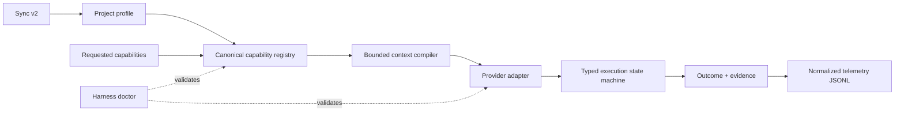
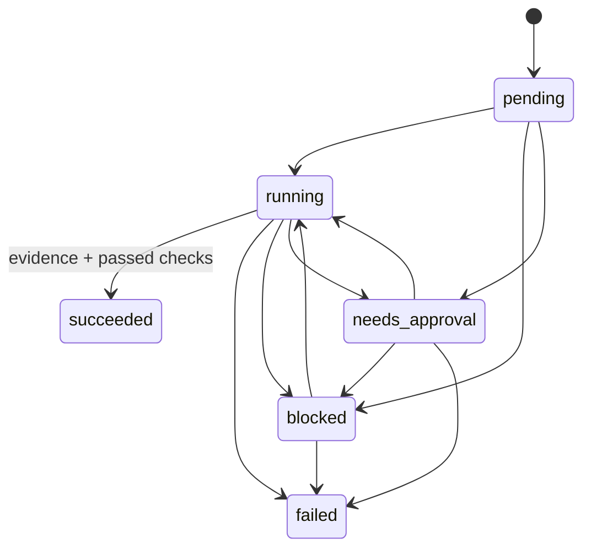

# Harness Runtime v3

## 목표

프로젝트가 커져도 하네스가 이름 충돌, 과도한 컨텍스트, 허위 성공, 파괴적 동기화 때문에 품질이 떨어지지 않도록 실행 제어면을 분리한다. 핵심 원칙은 다음과 같다.

- 스킬·에이전트·워크플로우는 canonical capability ID로만 선택한다.
- 프로젝트별 차이는 project profile과 overlay로 분리한다.
- 모델에게 전달하는 파일은 context budget 안에서 manifest로 확정한다.
- 프로세스 종료 코드와 작업 성공을 분리한다.
- 성공은 criterion check와 evidence가 있는 typed outcome으로만 인정한다.
- 동기화는 기본 dry-run이며 대상 프로젝트의 전용 파일을 삭제하지 않는다.
- Claude, Codex, Gemini, OpenCode 차이는 provider adapter registry에서 표현한다.
- 이미지 생성 provider 정책은 core provider registry와 분리한다.

## 구조



| 표면 | 기준 파일 | 역할 |
|---|---|---|
| Capability | `.claude/registry/capabilities/*.json` | kernel·workflow의 canonical ID, alias, context 선언 |
| Agent | `.claude/registry/agents/*.json` | agent ID와 frontmatter/source의 1:1 연결 |
| Skill | `.claude/registry/skills/*.json` | skill ID와 frontmatter/source의 1:1 연결 |
| Provider | `.claude/registry/providers/core.yaml` | CLI별 instruction/skill/hook/tool 지원 차이 |
| Contract | `.claude/registry/contracts/*.schema.json` | profile, context, execution, telemetry 구조 |
| Project | `.claude/registry/projects/*.json` | project profile과 동기화 대상 registry |
| Pack | `.claude/project-packs/default/pack.json` | 공유할 파일, symlink, 제외 규칙 |

`core.yaml`은 JSON 문법으로 작성된 YAML 호환 파일이다. 런타임은 외부 YAML 패키지 없이 Python 표준 라이브러리만 사용한다.

일반 모델 라우팅은 모델명을 고정하지 않고 `reasoning_high`, `implementation`, `fast_scan`, `independent_critic` quality class로 요청한다. 각 class는 필요한 capability와 tool을 선언하고 실제 모델 선택은 project/provider adapter가 담당한다. 일반 모델명 고정은 금지하며 이미지 모델 예외는 별도 image provider policy가 담당한다.

이미지 정책은 exact Gongnyang byte/validator와 active route를 로컬에서 검증하고, Codex `image_gen__imagegen`을 별도 host tool contract로 선언한다. required model은 `gpt-image-2`이고 fallback은 없다. 다만 host tool schema가 model 필드를 노출하지 않으므로 model identity는 로컬 attestation이 아니라 명시적인 Codex trust root다. 일반 provenance는 `generated_under_trusted_host_contract`, strict model proof가 필요한 경우는 `blocked_imagegen_model_unverifiable`다.

## Canonical registry

```bash
python3 scripts/harness-registry.py validate
python3 scripts/harness-registry.py list
python3 scripts/harness-registry.py resolve core context-compiler
python3 scripts/harness-registry.py inventory
python3 scripts/harness-registry.py build \
  --output .claude/registry/generated/inventory.json
python3 scripts/harness-registry.py validate --strict-legacy
```

활성 capability·skill·agent 사이에서 canonical ID나 alias가 충돌하면 `active_name_collision`으로 분류해 실패한다. disabled/deprecated 항목과의 충돌은 별도 warning으로 분류한다. 전체 레거시 skill/agent tree의 frontmatter 중복은 기본 검사에서 경고하고 `--strict-legacy`에서는 실패한다. 정적 registry 항목의 `frontmatter_name`이 둘 이상의 source와 충돌하면 compile이 실패하고, generated 중복 항목은 아래 qualified ID로만 안전하게 선택할 수 있다.

정적 registry에는 kernel과 명시적으로 승격한 핵심 agent/skill만 둔다. 나머지 전체 자산은 body를 읽지 않고 최대 64 KiB·512줄로 제한한 frontmatter prefix만 스캔해 generated inventory로 만든다. 각 항목에는 path hash 기반 stable ID, kind, source, frontmatter name, duplicate group/count, status가 들어간다.

- 이름이 유일하면 `design-harness`처럼 기존 이름을 alias로 사용할 수 있다.
- `architecture`, `project-setup`처럼 중복된 이름은 bare alias를 만들지 않는다.
- 중복 항목은 `skill:fastapi-agent-skills/architecture`, `skill:flutter-agent-skills/project-setup` 같은 qualified alias 또는 stable ID로 선택한다.
- generated snapshot은 감사·배포용 산출물이고, context compiler는 실행 시 같은 bounded inventory를 재생성해 stale snapshot에 의존하지 않는다.

## Project profile과 context compiler

기본 profile은 `.claude/registry/projects/default.json`이다. profile은 pack, provider, 기본 capability, byte budget, 보호 경로, overlay를 선언한다.

`--project-profile`을 생략하면 이 최소 default profile을 사용한다. 명시한 profile 파일이 없거나 유효하지 않을 때 임의 추론으로 계속하지는 않는다.

```bash
python3 scripts/harness-context.py \
  --project-profile .claude/registry/projects/default.json \
  --capability safety.context-pack-gate \
  --output /tmp/context-manifest.json
```

결과 manifest에는 선택된 파일의 경로, byte 수, SHA-256, 소유 capability와 budget 때문에 제외된 파일의 사유가 기록된다. `required_context=true`인 파일이 없거나 budget을 넘으면 일부 context로 계속 실행하지 않고 compile 자체가 실패한다.

## Typed execution



상태는 `pending`, `running`, `succeeded`, `failed`, `blocked`, `needs_approval`만 사용한다. `failed`, `blocked`, `needs_approval`에는 `stop_reason`이 필수다. `succeeded`에는 다음이 모두 필요하다.

- `attempt >= 1`
- 하나 이상의 success criterion
- 하나 이상의 typed, hashed artifact evidence (`type`, `description`, `producer`, `command`, `exit_code`, `status`, `path`, `sha256`, `bytes`)
- 모든 criterion에 대응하는 `status=passed` check

`artifact_root`는 `artifacts`로 고정한다. `path`는 outcome 옆 `artifacts/`를 기준으로 하는 non-symlink 상대 경로이며, 절대 경로·parent traversal·symlink component는 거부한다. 최종 검증은 파일을 다시 읽어 byte 수와 SHA-256을 비교한다. 설명 문자열만 쓴 evidence는 diagnostic일 뿐 `succeeded`를 만들지 못한다.

직접 사용할 때는 다음과 같다.

```bash
python3 scripts/harness-execution.py init \
  --file /tmp/outcome.json \
  --id task-1 \
  --objective "registry 검증" \
  --success-criterion "registry validation passes"

python3 scripts/harness-execution.py transition \
  --file /tmp/outcome.json --to running --reason started

python3 scripts/harness-execution.py transition \
  --file /tmp/outcome.json --to succeeded \
  --evidence '{"type":"test-log","description":"registry test passed","producer":"harness-registry","command":["python3","scripts/harness-registry.py","validate"],"exit_code":0,"status":"passed","path":"registry-test.log","sha256":"<actual-lowercase-sha256>","bytes":<actual-bytes>}' \
  --check "registry validation passes=passed"
```

위 placeholder는 실제 artifact에서 계산한 값으로 바꿔야 한다. hash나 byte 수가 달라지면 transition/final validation이 실패한다.

`orchestrate-worktrees.py`도 같은 계약을 사용한다. worker의 shell이 0으로 끝나도 `.orchestration/{session}/{worker}/outcome.json`이 없거나 계약을 통과하지 못하면 `failed`다. outcome의 `execution_id`는 `{session}:{worker-slug}`이고 success criteria는 plan에서 받은 항목과 정확히 같아야 한다.

launcher는 provider 이름을 하드코딩하지 않고 registry의 provider-native binding으로 resolve한다.

```bash
python3 scripts/harness-provider.py \
  --provider claude \
  --quality-tier implementation \
  --output /tmp/provider-binding.json
```

orchestrator는 resolved `execution_adapter`와 quality binding을 사용하며 raw `claude -p`, `codex`, `gemini` launcher 문자열을 plan에 복제하지 않는다.

`--dangerously-skip-permissions`가 꼭 필요한 별도 환경에서는 plan에 `allow_dangerous_permissions: true`와 사람이 확인한 `dangerous_permissions_approval` 사유를 모두 명시해야 한다. 둘 중 하나라도 없으면 plan load 단계에서 실패한다.

## Telemetry

`.claude/hooks/usage-tracker.sh`는 `harness.telemetry.v1` 이벤트를 compact JSON 한 줄로 기록한다. 기존 hook이 남긴 여러 줄 pretty JSON도 읽을 수 있다.

```bash
python3 scripts/harness-telemetry.py validate .claude/logs/usage.jsonl
python3 scripts/harness-telemetry.py normalize .claude/logs/usage.jsonl \
  --output /tmp/usage.normalized.jsonl
python3 scripts/usage-report.py
```

정규 필드는 timestamp, session, provider, event type, subject type/id, status, duration, context bytes, metadata다.

## Doctor

```bash
python3 scripts/harness-doctor.py
python3 scripts/harness-doctor.py --json
python3 scripts/harness-doctor.py --strict
```

doctor는 다음을 확인한다.

- `AGENTS.md`, `GEMINI.md`, `.agents/skills` symlink
- common rules 존재
- canonical registry와 legacy frontmatter 충돌
- hook 파일, 실행 권한, settings 연결
- Claude/Codex/Gemini/OpenCode provider adapter와 안전한 권한 기본값
- 이미지 정책 분리 경계
- eval preset 존재
- orchestrator의 위험 권한 기본값 제거 여부

## 공식 설치와 export closure

`scripts/install.sh`도 sync v2와 같은 승인 경계를 사용한다. 기본 실행은 read-only dry-run이고 실제 설치나 zip 생성에는 `--apply`가 필요하다.

```bash
# ~/.claude 설치 계획
bash scripts/install.sh --link

# source-linked runtime 적용
bash scripts/install.sh --link --apply

# 독립 copy 설치 적용
bash scripts/install.sh --copy --apply

# 배포 zip 계획과 적용
bash scripts/install.sh --export
bash scripts/install.sh --export --apply
```

설치 root인 `~/.claude`는 project pack과 같은 상대 경로를 유지한다. `CLAUDE.md`, `contexts`, canonical `.claude/{agents,commands,hooks,rules,skills,templates,evals,registry,project-packs}`, runtime scripts, Gongnyang `third_party/gongnyang-prompt-kit`을 함께 설치한다. `AGENTS.md`, `GEMINI.md`, `.agents/skills`와 Claude Code 호환용 top-level component symlink도 만든다. copy와 export 모두 `.claude/skills/image-prompt -> ../../third_party/gongnyang-prompt-kit/skills/image-prompt`를 보존하거나 재구성하며, 기존 user-level `~/.claude/settings.json`은 덮어쓰지 않는다.

remote bootstrap인 `docs/install.sh`는 저장소 clone/update 자체가 명시적인 설치 동작이므로 내부 installer를 `--apply`와 함께 호출한다.

## Sync v2

기존 `sync-to-projects.sh`의 positional path 사용법은 유지하지만 기본 동작은 apply에서 dry-run으로 변경됐다. wrapper와 Python CLI 모두 `--apply`가 없으면 파일·symlink·backup을 생성하거나 수정하지 않는다.

```bash
# 등록 프로젝트 전체 계획만 출력
bash scripts/sync-to-projects.sh

# 한 프로젝트 계획
bash scripts/sync-to-projects.sh /path/to/project

# canary 1개 적용 + rollback manifest 보관
bash scripts/sync-to-projects.sh --canary --apply \
  --manifest-out /tmp/harness-canary.json

# 원복. 적용 이후 사용자가 다시 수정한 파일은 건너뛴다.
python3 scripts/harness-sync.py --rollback /tmp/harness-canary.json
```

대상 목록은 `.claude/registry/projects/projects.json`에서 관리한다. apply는 다음 안전장치를 갖는다.

- target-only 파일은 삭제하지 않음. 단, pack의 `tombstones`에 경로와 과거
  SHA-256이 함께 선언된 하네스 소유 파일만 backup 후 삭제하며, 해시가 다르면
  `conflict-tombstone-unowned`로 중단
- tombstone 적용은 project-root-relative directory descriptor에서 대상을 atomic
  quarantine한 뒤 같은 entry를 재검증·backup한다. 중간에 예상하지 못한 파일이
  나타나면 이를 삭제하지 않고 recovery quarantine을 남긴 채
  `rollback-incomplete`로 중단
- profile의 `protected_paths`를 덮어쓰지 않음
- 대상의 `.claude/harness-overlay.json`에 추가 보호 패턴을 선언할 수 있음
- default profile은 `image-generation` pack overlay도 합성해 Gongnyang third-party runtime, 보존된 image-prompt symlink, verifier/update/test 스크립트를 함께 배포
- overlay의 `settings_merges`는 `.claude/settings.json` 전체를 복사하지 않고 기존 `matcher=Bash` PreToolUse 항목에 block-text-overlay command만 append-if-missing으로 병합
- settings merge는 기존 env/hook을 보존하고 두 번 apply해도 같은 command를 중복 추가하지 않음
- sync manifest에는 settings 원문을 남기지 않고 전후 hash/byte 수와 backup 위치만 남김
- 기존 파일·symlink를 프로젝트 내부 `.claude/harness-backups/{run-id}`에 보관
- manifest에 create/update/unchanged/skip/conflict와 전후 fingerprint 기록
- rollback 시 after fingerprint가 달라진 파일은 보존하고 skip
- 파일을 덮어써야 하는 위치가 디렉터리면 자동 삭제하지 않고 conflict로 실패

권장 rollout은 `dry-run → canary apply → doctor/test → 전체 apply` 순서다.

## Design Runtime promotion boundary

Design Runtime의 로컬 최종 성공 상태는 `ready_for_external_promotion`이다. 로컬 `design-runtime.py prepare-review`는 canonical capture receipt와 evidence projection에 대한 외부 capture-authority 서명을 요구하고, `finalize`는 live detector, trusted evidence, signed capture/critic attestation, register grader를 다시 검증하지만 `passed`를 쓰지 않는다. 검증된 artifact hash와 attestation을 인증된 외부 provider/orchestrator가 자체 trust boundary에서 확인한 경우에만 `passed`로 승격할 수 있다. 외부 승격이 없으면 문서와 handoff도 로컬 상태를 그대로 보고한다.

## 호환성

- 기존 orchestration 상태 `not_started`, `waiting`, `completed`는 읽을 때 각각 `pending`, `pending`, `succeeded`로 매핑한다. 새로 쓰는 상태 파일은 typed JSON이다.
- 기존 pretty JSON usage log는 report와 normalizer가 계속 읽는다. 새 hook 기록만 compact JSONL이다.
- sync wrapper와 positional target 인자는 유지된다. 단, 실제 변경에는 이제 `--apply`가 필수다.
- 기존 전체 skill/agent catalog의 중복 이름은 즉시 제거하지 않았다. 기본 doctor에서는 가시적인 warning으로 남기고, canonical registry와 선택 capability에서는 차단한다.
- provider core registry는 일반 실행 adapter만 소유한다. 이미지 생성 모델·prompt 정책은 별도 provider 정책에서 관리한다.

## 검증

```bash
python3 -m unittest discover -s tests/runtime -v
python3 -m unittest discover -s tests/runtime -p 'test_install_script.py' -v
python3 scripts/harness-registry.py validate
python3 scripts/harness-context.py --output /tmp/harness-context.json
python3 scripts/harness-doctor.py
bash -n .claude/hooks/usage-tracker.sh scripts/install.sh docs/install.sh scripts/sync-to-projects.sh
python3 -m py_compile scripts/harness*.py scripts/orchestrate-worktrees.py scripts/usage-report.py
```
